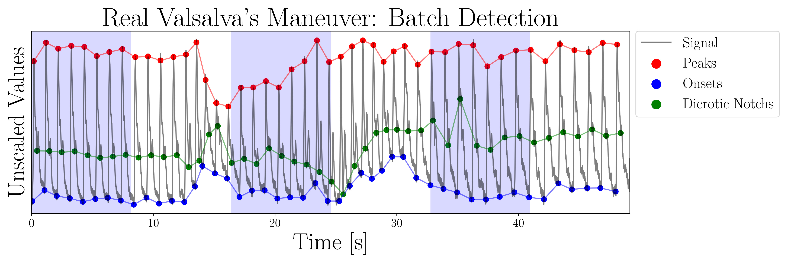

# deepdelineator

The `deepdelineator` library can be used to detect characteristic points in arterial blood pressure waveforms using deep learning techniques to improve the accuracy of the detection. At the same time, regions with noise can be identified automatically. 



## Installation
`pip install deepdelineator`

## Usage
### `pred_from_numpy()`

**Description**:  
This is the main function to obtain Fiducial Points (FiPs) from input signals.

---

### **Inputs**

1. **`signal_list` (list)**:  
   A list containing multiple signals, each represented as a NumPy `ndarray`. Each `ndarray` must have the shape `(samples,)`.

2. **`s_f` (int)**:  
   The sampling frequency of the signals. All signals in `signal_list` must share the same sampling frequency.

---

### **Return**

**`detections` (dict)**:  
A dictionary where each key is the index of a signal (e.g., `detections[idx]`). Each value is a dictionary containing two main components:  
1. `resampled`: Information about the signal analyzed by the model at the model's sampling frequency (`rs_f = 125 Hz`).  
2. `original`: Information about the signal resampled to the provided sampling frequency (`s_f`).

---

### **Detection Structure**  

For each signal index (`detections[idx]`), the structure is as follows:
* `resample`: In terms of the model's sampling frequency (`125 Hz`).

#### **`resampled`**:  
- **`signal`**: The resampled version of the signal analyzed at the model's sampling frequency (`125 Hz`).  
- **`predictions`**: Class predictions made by the model.  
- **`onset`**: Detected onset indices.  
- **`peaks`**: Detected peak indices.  
- **`dn`**: Detected DN (decay or downward movement) indices.  
- **`beats_fips`**: List of completed beats, each represented as `[N° beat, start, peak, dn, end]`.  
- **`artifacts`**: A list of artifact indices.  
- **`rs_f`**: The resampled frequency, fixed at `125 Hz`.

#### **`original`**:  
- **`signal`**: The analyzed signal resampled . 
- **`predictions`**: Interpolated class predictions to match the given `s_f`. 
- **`onset`**: Onset indices. 
- **`peaks`**: Peak indices. 
- **`dn`**: DN indices. 
- **`beats_fips`**: List of completed beats (indices). 
- **`artifacts`**: A list of artifact indices. 
- **`s_f`**: The given `s_f`.

Note: `original` indices are in terms of the provided sampling frequency (`s_f`).

```python
from deepdelineator.utils import load_delineator

delineator = load_delineator()
s_f = 500 # Sampling frecuency of the signals, adjust to your data
# Detection!
detections = model.pred_from_numpy(signal_list=list_of_abp_signals, s_f=s_f)
```

For more details, please refer to the `examples` folder.


# Citing
If you consider this work useful, please cite the following paper:

## A Delineator for Arterial Blood Pressure Waveform Analysis Based on a Deep Learning Technique


```
@INPROCEEDINGS{9630717,
  author={Aguirre, Nicolas and Grall-Maës, Edith and Cymberknop, Leandro J. and Armentano, Ricardo L.},
  booktitle={2021 43rd Annual International Conference of the IEEE Engineering in Medicine   Biology Society (EMBC)}, 
  title={A Delineator for Arterial Blood Pressure Waveform Analysis Based on a Deep Learning Technique}, 
  year={2021},
  volume={},
  number={},
  pages={56-59},
  doi={10.1109/EMBC46164.2021.9630717}}

```
